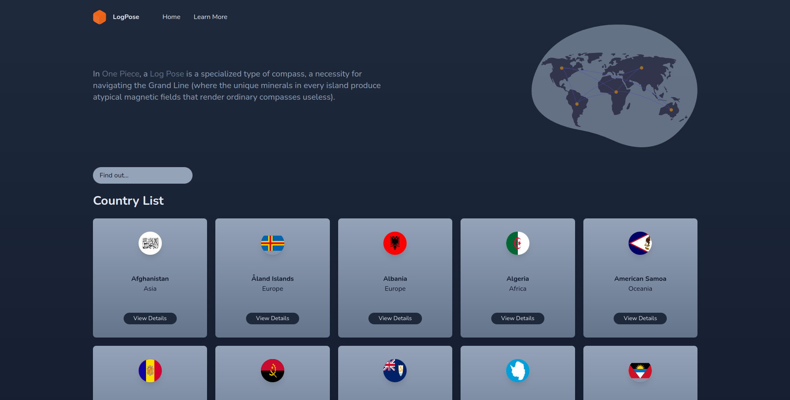

<a name="readme-top"></a>

<br />
<div align="center">
  <h1 align="center">LogPose</h1>

  <p align="center">
    <em>A simple Next.js app to browse information about countries. Powered by <a href="https://restcountries.com">restcountries</a>.</em>
    <br />
    <br />
    <a href="https://logpose.vercel.app">View Demo</a>
    ·
    <a href="https://linkedin.com/in/marceljsh">See Author</a>
  </p>
</div>

<!-- ABOUT THE PROJECT -->
## Overview ℹ️

Initially, `Log Pose` is a compass-like tool from <a href="https://onepiece.fandom.com/wiki/One_Piece">One Piece</a> that helps us to explore the Grand Line. LogPose will show you wonders all over the world!




### Built With

* [Next.js](https://nextjs.org/)
* [Tailwind](https://tailwindcss.com/)
* [Restcountries API](https://restcountries.com/)
* [react-icons](https://www.npmjs.com/package/react-icons)
* [react-awesome-reveal](https://www.npmjs.com/package/react-awesome-reveal)

<!-- LIVE DEMO -->
### Live Demo

You can check a running version of this project <a href="https://logpose.vercel.app">here</a>

<p align="right">(<a href="#readme-top">back to top</a>)</p>

<!-- GETTING STARTED -->
## Getting Started

To get a local copy up and running follow these simple example steps.

### Prerequisites

This is an example of how to list things you need to use the software and how to install them.

* Node.js 16.8 or later

### Installation

1. Clone the repo
   ```sh
   git clone https://github.com/marceljsh/LogPose.git
   ```
2. Install NPM packages
   ```sh
   npm install
   ```
2. Run the application
   ```sh
   npm run dev
   ```

<p align="right">(<a href="#readme-top">back to top</a>)</p>

## License 📜

Copyright © 2023, [Marcel Joshua](https://github.com/marceljsh). _This property is intended as a self exploration requirement_
